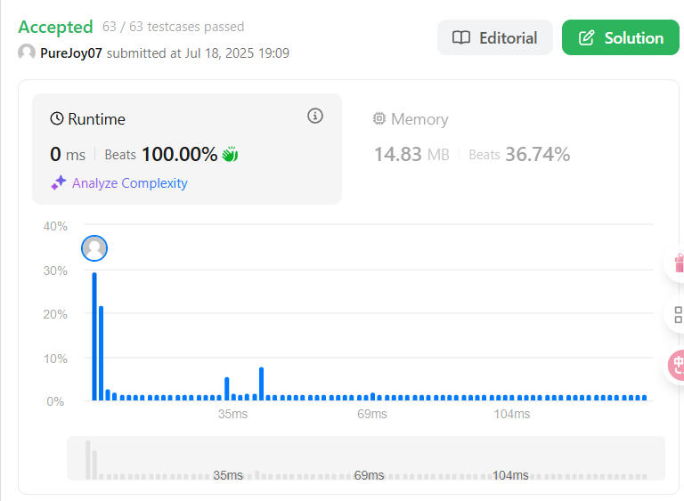

# [1.Two Sum](https://leetcode.com/problems/two-sum/description/)

## 一、题目描述

> Given an array of integers `nums` and an integer `target`, return *indices of the two numbers such that they add up to `target`*.
>
> You may assume that each input would have ***exactly\* one solution**, and you may not use the *same* element twice.
>
> You can return the answer in any order.

## 二、用到的容器

- **解法一(maijiko):**

  std::unordered_map

## 三、提交结果

- **解法一:**
    

## 四、解题思路

- **解法一:**

    将遍历过的数字存起来，如果在已经遍历的数组可以找到 `target - nums[i]` ，则返回结果

    1. 将已经遍历过的数字按照 **数值-数组下标** 的键值对存储在 `traversedNum`

    2. 遍历下一个数字 `num`  时，在 `traversedNum` 中寻找是否存在 'target - nums[i]'
        - 如果存在，则返回 当前下标 `i` 和  存储在 `traversedNum` 中对应的下标
        - 如果不存在，则继续遍历 `nums`

## 五、代码实现

- **解法一**

    ``` c++
    class Solution {
    public:
        vector<int> twoSum(vector<int>& nums, int target) {
            std::unordered_map<int, int> traversedNum;
            for (int i = 0; i < nums.size(); i++) {
                if (traversedNum.count(target - nums[i])) {
                    return {i, traversedNum[target - nums[i]]};
                }
                traversedNum[nums[i]] = i;
            }
            return {0, 0};
        }
    };
    ```
